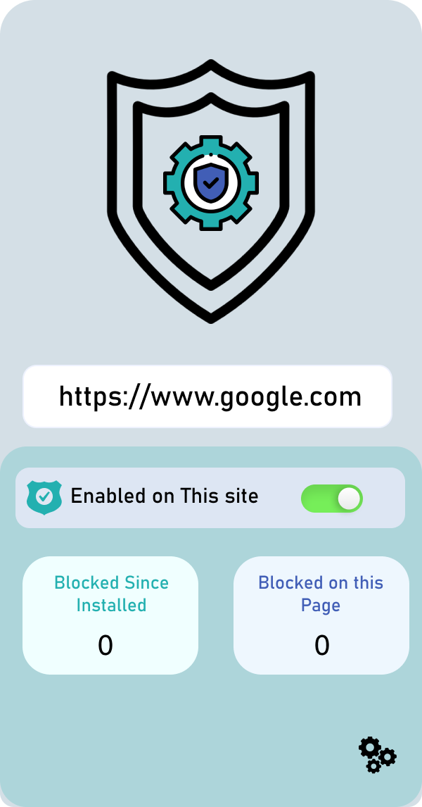
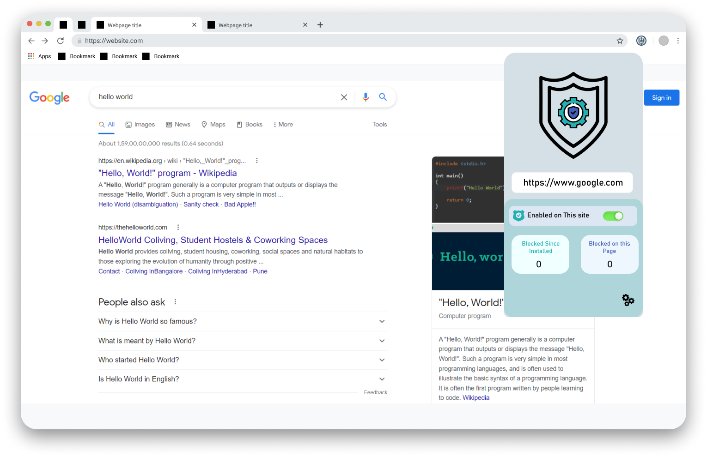

# SafeGuard: Ad, Tracker, and Malware Blocker

## Author
- Aditya Kumavat

## Introduction
SafeGuard is a browser extension that enhances your web browsing experience by blocking ads, trackers, and malware. This powerful extension utilizes trusted filter rules, including those from fanboy, uBlock Origin, and other reliable sources, to efficiently block unnecessary content from web pages.

## Key Features
- **Ad Blocking**: SafeGuard blocks intrusive and annoying ads, providing you with a clean and distraction-free browsing experience.
- **Tracker Blocking**: Prevent trackers from monitoring your online activities and safeguard your privacy.
- **Malware Protection**: Stay protected from malicious content and potential security threats while browsing the web.
- **Filter Rules**: The extension utilizes widely recognized filter rules from trusted projects like Adblocker Ultimate, uBlock Origin, and more, ensuring effective content blocking.

## Why Choose SafeGuard?
- **Reliable Protection**: SafeGuard employs well-established filter rules, making it a reliable solution to keep unwanted content at bay.
- **Easy-to-Use**: With a user-friendly interface, the extension is easy to install, configure, and use, even for non-technical users.
- **Open-Source**: SafeGuard is an open-source project, thanks to the contributions and support from various other projects like Adblocker Ultimate and uBlock Origin.

 
 

## How to Get Started
1. Install the SafeGuard browser extension from the respective extension store (Chrome Web Store, Firefox Add-ons, etc.).
2. Once installed, the extension will automatically start blocking ads, trackers, and malware while you browse the web.

## Contribution Guidelines
We value contributions from the community to improve SafeGuard and make it even more effective at blocking unwanted content. If you want to contribute, please follow the guidelines described in [CONTRIBUTING.md](link_to_contributing.md).

## Support and Feedback
For any questions, issues, or feedback, please create an issue in the repository

Stay protected and enjoy a clutter-free browsing experience with SafeGuard! Join us in making the web a safer and more enjoyable place by exploring our repository and supporting open-source projects like Adblocker Ultimate, uBlock Origin, and more.
